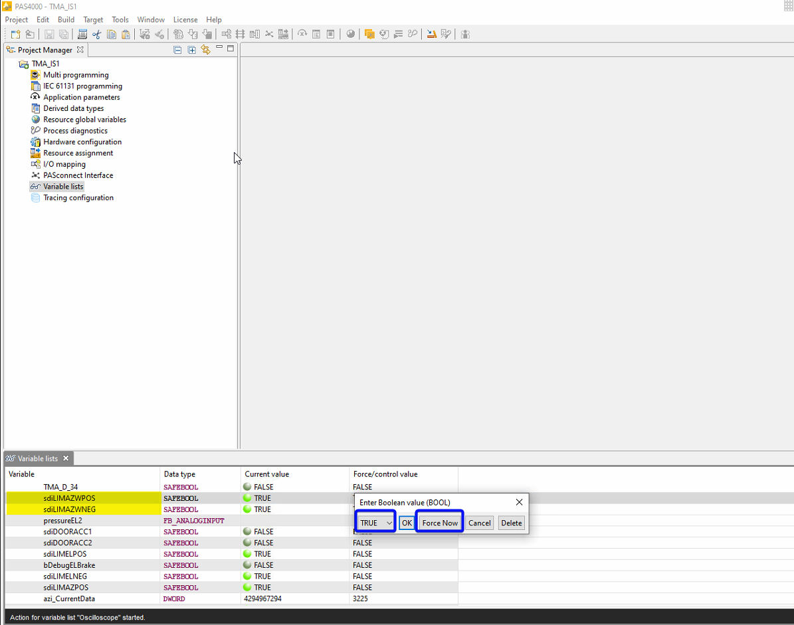
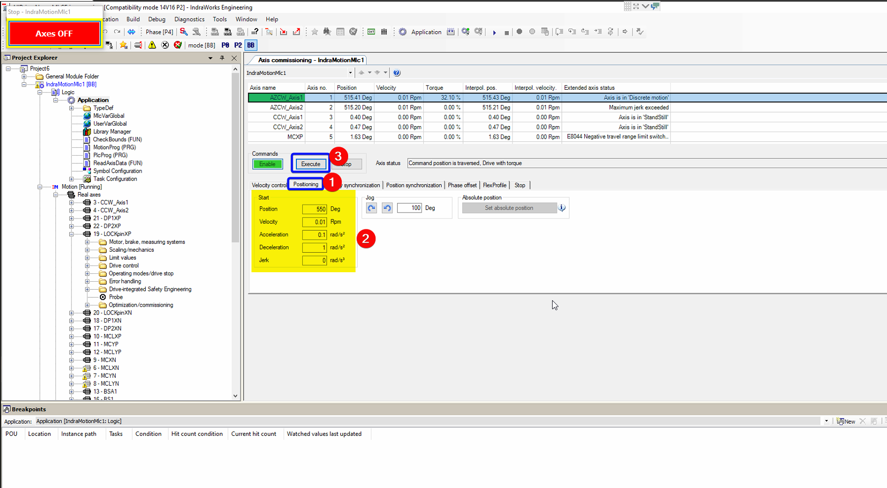

# Check Encoder Tape

| **Requested by:** | **AURA** |
|-------------------|----------|
| **Doc. Code**     |        |
| **Editor:**       | A. Izpizua         |
| **Approved by:**  | J. Garcia         |

## Index

- [Check Encoder Tape](#check-encoder-tape)
  - [Index](#index)
  - [Introduction](#introduction)
  - [Azimuth Tape](#azimuth-tape)
    - [Azimuth Tape Procedure](#azimuth-tape-procedure)
    - [Azimuth Tape Execution](#azimuth-tape-execution)
  - [Elevation Tape](#elevation-tape)
    - [Elevation Tape Procedure](#elevation-tape-procedure)
    - [Elevation Tape Execution](#elevation-tape-execution)

## Introduction

This document shows how to proceed with the telescope to get data from the EIB and send to Heidenhain to check the status
of the encoder tape.

To check the tape all the tape must be recorded, so a movement that makes heads to travel the tape must be performed.
This movement is performed in a different way to check azimuth or elevation, so in this document there is section for each axis.

## Azimuth Tape

In this section the azimuth encoder tape status check is explained

### Azimuth Tape Procedure

The following steps must be performed

- Configure the EIB using the [This configuration file](configFiles/config_std_EIB8791_withAdcValues.txt).
- Configure the data capture in the EIB software
- Start the capture in the EIB software
- Move the telescope 360 deg using the ACW
- Stop the capture in the EIB software

### Azimuth Tape Execution

Next steps shows how to perform the capture of the data. During this operation the brakes are forced to release in some places. Make sure that the system is safe before releasing the brakes. To engage the brake there are two options, unforce the brakes or press a E-Stop (actually any interlock to the azimuth axis will engage the brakes automatically).

- Start the OSS using the EUI.
- Check that there are not any interlocks for the azimuth axis.
- Open the PAS4000 and the last version of the TMA safety project (TMA_IS1). The support PC, has the last version of this project hosted in this [repo](https://gitlab.tekniker.es/aut/projects/3151-LSST/SafetyCode/TMA_IS.git).
- Open the variable list and run the observing of the variables.
  
  
- Force sdiLIMAZWPOS and sdiLIMAZWNEG.
  
  - It is also recommend to force sdoHasStopOss and sdoSoftStopOss to avoid affecting the OSS if a E-Stop must be pressed during the test.
- Check that the variables are forced.
  
- Start axis commissioning in the Indraworks.
  
  - If commanding of the motors is not possible because there is PLC program active, stop the PLC application.
  
  
- Activate one AZCW axis in the Indraworks (AZCW_Axis1 or AZCW_Axis2).
- Release the Azimuth brake putting the bDebugAzBrake to True.
  
- Wait until the brakes are released. The variable stmBrakeAZ monitors the brakes status, and all brakes are released when this variables shows 50.
  
- Move to 550 deg (this is 360+190 deg) or to 170 (360-190 deg) the one is closest to the actual position [^1].
  - Select the positioning tab.
  - Set the position to 550 or 170.
  - Set the velocity (maximum velocity 0.04rpm).
  - Set the acceleration (maximum acceleration 0.1 rad/s^2).
  - Set the deceleration (maximum acceleration 1 rad/s^2).
  - Set the Jerk to 0.
  
[^1]: The AZCW shows the azimuth position +360 deg. So when moving AZCW to 550 or 170 deg the Azimuth axis is moved to 190 or -190 deg.
- Wait until movement finished. The selected drive achieved the settled position.
- Engage the brake putting the bDebugAzBrake to False.
- Connect to the EIB using the Heidenhain's EIB8 application.
  - Open EIB8Application.exe.
  - Set the IP Adress of the EIB to 139.229.171.20.
  - Click connect button.
  
- Load the configuration file to the application.
  - In the EIB application go to Configuration window.
  - Press the "Get Config List From File" and navigate to the configuration file.
  - The configuration file must be the one provided by Heidenhain. It is in this repo. [Configuration file](configFiles/config_std_EIB8791_withAdcValues.txt).
  
- Change the IP and the mac for the UDP host in the configuration window.
  
  - The mac could be checked in the EIB8 application, in the Application window. Also any other windows tool could be used to check the mac for the selected NIC.
  
  - The values for the Tekniker support PC are:
    - IP: 139.229.171.5.
    - MAC: 00.13.3b.5b.23.e4.
- Write the configuration to the EIB.
  
- Configure the frequency at 10kHz.
  - The rotation speed will be 0.04rmp=0.24deg/s. So it will take 1500s to rotate 360deg.
  - The azimuth tape has 1200000lines. So 1200000lines/1500s=800lines/s=800Hz. As Heidenhain ask to have at least 10 point between lines the frequency must be at least 8kHz.
  
- Enable the PTM to start getting data from the EIB.
  
- Check the communication.
  - Go to UDP display window and click "UDP PD Receiving and Displaying" button.
  - Check that data is received in the table.
  
- Configure the UDP data dumping.
  - Go to UPD Dumping window.
  - In the "File for dumping data" insert the path to the file to store de data or navigate to the location. Use a new file.
  - In the "Dumping format" select the "EIB8_PDL_DUMP_RAW_BINARY" format.
  
- Start the UDP dumping by clicking in the "UDP PD Dump Start" button.
  
- Release the brake putting the bDebugAzBrake to True.
- Start movement with ACW.
  - Start going to 400 deg if the movement starts in 550 deg(or 320 if the movement started in 170 deg). This avoids the AZCW start moving in opposite direction to the desired one, because it detects that the destination is closed closing the impossible turn.
  - When the axis is close to 400 deg change the setpoint to 300 deg (or 420 if the movement started in 170 deg).
  - When the axis is close to 360 deg change the setpoint to 170 deg (or 550 if the movement started in 170 deg).
- When the axis stops because the last position (170 deg or 550 deg) is reached, stop the UPD dumping.
- Engage the brake putting the bDebugAzBrake to False.
- Move AZCW to 173 deg (or to 547 deg).
- Unforce all the forced variables in the PAS4000.
- Disable the drive in the Indraworks.
- Start the PLC application in the Indraworks.
- Check the Bosch Telemetry is running properly.
  - In the EUI open the Balancing system window.
  - Switch on all the Balancing axes.
  - Select one balancing axis and copy the actual position.
  
  - Move 5 mm and check the position data is actualized properly.
  - Move again to the copied position.
- Close the Indraworks.
- Exit the EUI.
- Reboot the AxesPXI.
  - Connect to the AxesPXI using ssh and check that the connected PXI is the AxePXI.
```bash
$ ssh admin@139.229.171.26
NI Linux Real-Time (run mode)

Log in with your NI-Auth credentials.

admin@139.229.171.26's password:
Last login: Tue May 30 16:20:11 2023 from 139.229.171.5

 █████  ██   ██ ███████ ███████       ██████  ██   ██ ██
██   ██  ██ ██  ██      ██            ██   ██  ██ ██  ██
███████   ███   █████   ███████ █████ ██████    ███   ██
██   ██  ██ ██  ██           ██       ██       ██ ██  ██
██   ██ ██   ██ ███████ ███████       ██      ██   ██ ██

```
  - Reboot the PXI
```bash
  admin@AxesPXI:~# reboot
```
- Wait for AxesPXI to restart. Check with a ping.
- Check that the AxesPXI restarted properly.
```bash
admin@AxesPXI:~# cat /var/log/messages | grep LabVIEW_Custom
2023-05-30T16:12:23.216+00:00 AxesPXI LabVIEW_Custom_Log: Main Started
2023-05-30T16:12:28.216+00:00 AxesPXI LabVIEW_Custom_Log: Main axes task launched
2023-05-30T16:12:28.217+00:00 AxesPXI LabVIEW_Custom_Log: Encoder task launched
2023-05-30T16:12:28.221+00:00 AxesPXI LabVIEW_Custom_Log: Timed Loops Processors: Control Loop Azimuth: 5
2023-05-30T16:12:28.225+00:00 AxesPXI LabVIEW_Custom_Log: Timed Loops Processors: Control Loop Elevation: 6
2023-05-30T16:12:28.818+00:00 AxesPXI LabVIEW_Custom_Log: Timed Loops Processors: Trajectory Loop Azimuth: 4
2023-05-30T16:12:31.410+00:00 AxesPXI LabVIEW_Custom_Log: Timed Loops Processors: Trajectory Loop Elevation: 4
2023-05-30T16:12:34.902+00:00 AxesPXI LabVIEW_Custom_Log: Timed Loops Processors: Monitoring Loop 1: 2
2023-05-30T16:12:35.401+00:00 AxesPXI LabVIEW_Custom_Log: Timed Loops Processors: Encoder UPD Loop: 7
```
- Start the EUI.
- Open the Encoder window and power on the encoder and check it works correctly, without faults. Perhaps it needs a couple of reset-power actions.

## Elevation Tape

In this section the elevation encoder tape status check is explained

### Elevation Tape Procedure

The following steps must be performed

- Configure the EIB using the [This configuration file](configFiles/config_std_EIB8791_withAdcValues.txt).
- Configure the data capture in the EIB software.
- Start the capture in the EIB software.
- Move the telescope 90 deg using the winches and drills.
- Stop the capture in the EIB software.

### Elevation Tape Execution

Next steps shows how to perform the capture of the data. During this operation the brakes are forced to release in some places. Make sure that the system is safe before releasing the brakes. To engage the brake there are two options, unforce the brakes or press a E-Stop (actually any interlock to the azimuth axis will engage the brakes automatically).

Elevation must be moved with the winches connected to the telescope and using the drills to move the telescope. This procedure does not allows to perform the 90 degrees in one operation, so the telescope will be stopped several times. Each time the telescope is stopped for an operation, the data capture will be also stopped. Then before restarting the movement and start a new record file, the telescope must be moved backward at least 3 deg to get a reference mark already recorded in the previous file. There is a mark every 2000 counts/lines (nominal), and its count is equivalent to 1.2104339410E-5 rad = 6.935275e-4 degrees. So there is a mark every about 1.4 deg.

Some of the steps shown for elevation are equivalent to ones in the azimuth axis. So, some figures are omitted in this section but can be found in the [Azimuth Tape Execution](#azimuth-tape-execution).

- Start the OSS using the EUI.
- Check that there are not any interlocks for the azimuth axis.
- Open the PAS4000 and the last version of the TMA safety project (TMA_IS1). The support PC, has the last version of this project hosted in this [repo](https://gitlab.tekniker.es/aut/projects/3151-LSST/SafetyCode/TMA_IS.git).
- Open the variable list and run the observing of the variables.
